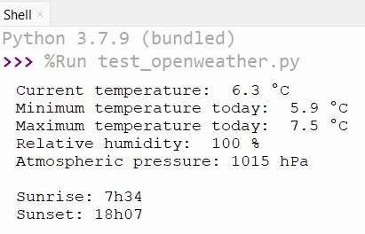

# Retrieving data from a web page.

In this example, I will test how to collect data from [openweathermap.org](https://openweathermap.org/current).

The code is based on HTTP requests returning JSON formated data.

The first thing to do is to create an account on openweathermap.org, it's free for a basic access. You will receive an APi key to use in the request.

#### My first test was on a Raspberry Pi 4, in Pyhton with the Thonny IDE.

The code is: [test_openweather.py](test_openweather.py)

The HTTP library module used is `request`

Result :

- [ ] To do : put credentials in a separate file

#### My second test was on a Raspberry Pi Pico, connected to a ESP8266 WiFi module, in MicroPyhton with the Thonny IDE.

The setup was the following:

I used a Pico Breadboard, ESP8266 was connected to UART1 of the Pico and the four LEDs to GPIO12 to 15. The LEDs will be used to show the wind direction.

The library module `esp8266`  was used. It includes WiFi and HTTP protocols.
`machine` module was also used to get access to GPIO and UART.

The code is: [ow_pico_ESP8266.py](ow_pico_ESP8266.py)

- [ ] To do : put credentials in a separate file
- [ ] To do : add a loop to repeat measurements
