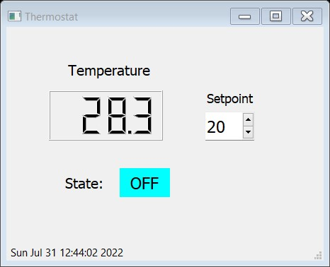

## Simulation of a thermostat using PyQt.

In this example, I created a small application to test PyQt.

The gui is the following :

It uses a SpinBox to enter a setpoint, a LCDNumber widget to display a random temperature (between 10 and 40 °C) and a label to show the state of the thermostat (On or Off) 
with a corresponding red or blue background color.

The GUI was designed wit Qt Designer. To download the designer alone its [here](https://build-system.fman.io/qt-designer-download).
